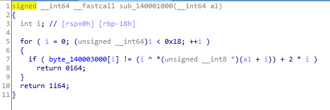
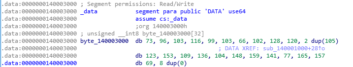

# rev-basic-3

rev-basic-3은 사용자의 입력값을 검증하여 Correct 또는 Wrong을 출력하는 프로그램이다.

일단 프로그램을 IDA로 분석해본다

### main 함수   
   
사용자의 입력을 받아 sub_140001000 함수에서 올바른 값인지 검증한다.

### sub_140001000 함수   
   
특정 연산을 통해 byte_140003000배열과 입력값을 비교하고 있다.

### byte_140003000 배열   
     
32크기 만큼 할당된 배열임을 확인할 수 있다.   

<br/>   
sub_140001000 함수에서 입력값을 검증하는 연산을 반대로 해주면 flag를 구할 수 있다.

```
byte_140003000 = [73, 96, 103, 116, 99, 103, 66, 102, 128, 120,105, 105, 123, 153, 109, 136, 104, 148, 159, 141, 77, 165, 157, 69, 0, 0, 0, 0, 0, 0, 0, 0,]

flag = ""
for i in range(24):
    flag += chr(byte_140003000[i]-(2*i)^i)
    
print(flag)
```
