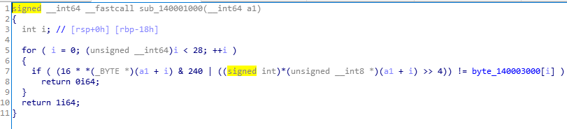
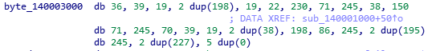

# rev-basic-4

주어진 파일을 IDA-pro로 분석해보면 입력값 검증 함수는 다음과 같다.   
   
<br/>

또한 byte_140003000는 다음과 같은 배열이다.   
   

따라서 이를 역산하는 코드를 작성하면 flag를 획득할 수 있다.
```
arr = [36, 39, 19, 198, 198, 19, 22, 230, 71, 245, 38, 150,
71, 245, 70, 39, 19, 38, 38, 198, 86, 245, 195, 195,
245, 227, 227, 0, 0, 0, 0, 0]

x=""
for i in arr:
    x += chr(((i&0xF0)>>4) | ((i&0x0F)<<4))
print(x)
```
