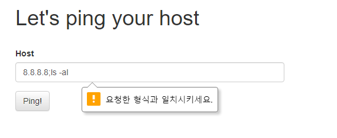
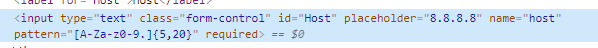
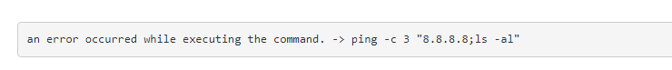
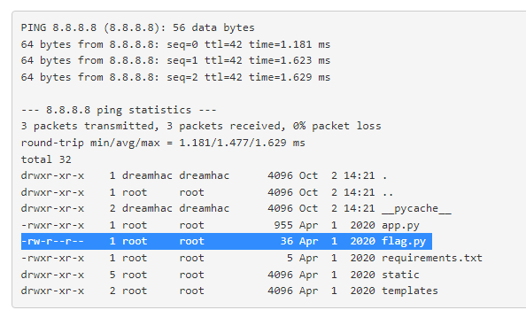
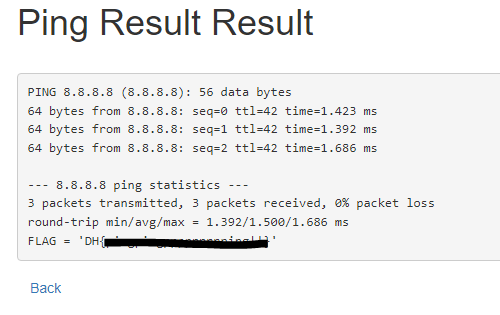

# command-injection-1

특정 Host에 ping을 보내는 서비스이며 Command Injection을 통해 플래그를 획득할 수 있다.   
<br/>

   
간단하게 command injection을 시도해보면 필터링이 있는 것을 확인할 수 있다.   
<br/>

   
이 기능을 우회하기 위해서 개발자 도구에서 ```pattern="[A-Za-z0-9.]{5,20}"``` 부분을 제거해준다.   

<br/>

   
에러가 발생하며 내용을 확인해보면 사용자가 입력한 값이 "으로 감싸있는 것을 볼 수 있다.   


<br/>

   
에러가 나지 않도록 ```8.8.8.8";ls -al"```처럼 입력해주면 command injection이 성공하고 flag.py를 확인할 수 있다.   


<br/>

  
이제 flag.py의 내용을 보기 위해  ```8.8.8.8";cat "flag.py```를 입력하면 flag를 확인할 수 있다.
