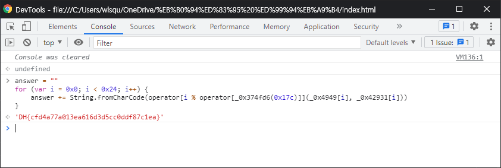

# funjs

처음 들어가면 입력 폼이 움직이고 디버거 모드가 되어있으므로 코드를 삭제해준다.

```
setInterval(moveBox,1000);
```
여기와
```
function moveBox() {
    box.posX = Math.random() * (window.innerWidth - 64); 
    box.posY = Math.random() * (document.documentElement.scrollHeight - 64); 
    box.style.marginLeft = box.posX + "px";
    box.style.marginTop  = box.posY + "px";
    debugger;
}
```
여기를 삭제하고
<br/><br/>
자바스크립트 main함수의 코드를 개발자모드 콘솔에서 실행시킨다.
```
var _0x1046=['2XStRDS','1388249ruyIdZ','length','23461saqTxt','9966Ahatiq','1824773xMtSgK','1918853csBQfH','175TzWLTY','flag','getElementById','94hQzdTH','NOP\x20!','11sVVyAj','37594TRDRWW','charCodeAt','296569AQCpHt','fromCharCode','1aqTvAU'];
        var _0x376c = function(_0xed94a5, _0xba8f0f) {
            _0xed94a5 = _0xed94a5 - 0x175;
            var _0x1046bc = _0x1046[_0xed94a5];
            return _0x1046bc;
        };
        var _0x374fd6 = _0x376c;
        (function(_0x24638d, _0x413a92) {
            var _0x138062 = _0x376c;
            while (!![]) {
                try {
                    var _0x41a76b = -parseInt(_0x138062(0x17f)) + parseInt(_0x138062(0x180)) * -parseInt(_0x138062(0x179)) + -parseInt(_0x138062(0x181)) * -parseInt(_0x138062(0x17e)) + -parseInt(_0x138062(0x17b)) + -parseInt(_0x138062(0x177)) * -parseInt(_0x138062(0x17a)) + -parseInt(_0x138062(0x17d)) * -parseInt(_0x138062(0x186)) + -parseInt(_0x138062(0x175)) * -parseInt(_0x138062(0x184));
                    if (_0x41a76b === _0x413a92) break;
                    else _0x24638d['push'](_0x24638d['shift']());
                } catch (_0x114389) {
                    _0x24638d['push'](_0x24638d['shift']());
                }
            }
        }(_0x1046, 0xf3764));
        var flag = document[_0x374fd6(0x183)](_0x374fd6(0x182))['value'],
            _0x4949 = [0x20, 0x5e, 0x7b, 0xd2, 0x59, 0xb1, 0x34, 0x72, 0x1b, 0x69, 0x61, 0x3c, 0x11, 0x35, 0x65, 0x80, 0x9, 0x9d, 0x9, 0x3d, 0x22, 0x7b, 0x1, 0x9d, 0x59, 0xaa, 0x2, 0x6a, 0x53, 0xa7, 0xb, 0xcd, 0x25, 0xdf, 0x1, 0x9c],
            _0x42931 = [0x24, 0x16, 0x1, 0xb1, 0xd, 0x4d, 0x1, 0x13, 0x1c, 0x32, 0x1, 0xc, 0x20, 0x2, 0x1, 0xe1, 0x2d, 0x6c, 0x6, 0x59, 0x11, 0x17, 0x35, 0xfe, 0xa, 0x7a, 0x32, 0xe, 0x13, 0x6f, 0x5, 0xae, 0xc, 0x7a, 0x61, 0xe1],
            operator = [(_0x3a6862, _0x4b2b8f) => {
                return _0x3a6862 + _0x4b2b8f;
            }, (_0xa50264, _0x1fa25c) => {
                return _0xa50264 - _0x1fa25c;
            }, (_0x3d7732, _0x48e1e0) => {
                return _0x3d7732 * _0x48e1e0;
            }, (_0x32aa3b, _0x53e3ec) => {
                return _0x32aa3b ^ _0x53e3ec;
            }],
            getchar = String[_0x374fd6(0x178)];
```
<br/><br/>
그리고 _0x374fd6(0x17c) 와 _0x374fd6(0x185)를 콘솔창에 입력하여 확인하여보면 length와 NOP !인 것을 확인할 수 있다.
   
<br/><br/>
나머지 코드를 살펴보면 아래와 같은 코드에서 for문을 통해 flag를 비교함을 알 수 있다.
```
for (var i = 0x0; i < flag[_0x374fd6(0x17c)]; i++) {
    if (flag[_0x374fd6(0x176)](i) == operator[i % operator[_0x374fd6(0x17c)]](_0x4949[i], _0x42931[i])) {} else {
        text2img(_0x374fd6(0x185));
        return;
    }
}
```

이것을 참고하여 다음과 같이 코드를 작성하면 flag를 획득할 수 있다.
```
answer = ""
for (var i = 0x0; i < 0x24; i++) {
    answer += String.fromCharCode(operator[i % operator[_0x374fd6(0x17c)]](_0x4949[i], _0x42931[i]))
}
```

