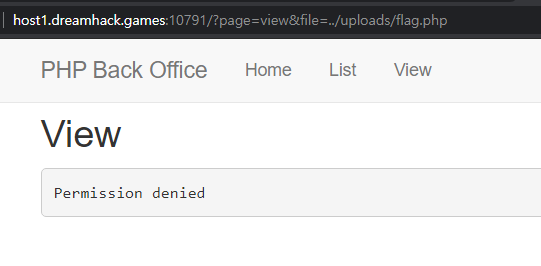

# php-1

주어진 힌트는 LFI 취약점을 이용하며, 플래그는 /var/www/uploads/flag.php에 위치하는 것이다.    
<br/>

```
<?php
    include $_GET['page']?$_GET['page'].'.php':'main.php';
?>
```
문제에서 주어진 소스코드를 보면 index.php 에서 main.php 를 include 함수를 통해 GET 방식으로 불러온다는 것을 볼 수 있다.   
<br/>
```
<?php
    $file = $_GET['file']?$_GET['file']:'';
    if(preg_match('/flag|:/i', $file)){
        exit('Permission denied');
    }
    echo file_get_contents($file);
?>
```
또한 view.php에서는 flag 문자열을 필터링 하는 것을 알 수 있다.   
   
flag 문자열을 필터링 당한 모습이다.
<br/>
<br/>
이러한 필터링은 php wrapper를 이용하면 우회할 수 있다.

php://filter의 경우, 서버안의 문서들을 열람할 수 있게 해주며
다음과 같은 방법을 활용하면, base64로 인코딩된 파일을 얻을 수 있다.
```
 www.[웹사이트주소]/?file=php://filter/convert.base64-encode/resource=파일명
```


