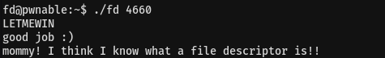

# 01. fd

## Source Code
```
#include <stdio.h>
#include <stdlib.h>
#include <string.h>
char buf[32];
int main(int argc, char* argv[], char* envp[]){
	if(argc<2){
		printf("pass argv[1] a number\n");
		return 0;
	}
	int fd = atoi( argv[1] ) - 0x1234;
	int len = 0;
	len = read(fd, buf, 32);
	if(!strcmp("LETMEWIN\n", buf)){
		printf("good job :)\n");
		system("/bin/cat flag");
		exit(0);
	}
	printf("learn about Linux file IO\n");
	return 0;

}
```   
<br/>   

* int로 반환된 인자는 0x1234와 뺄셈을 하여 fd변수에 값이 들아간다.   
```int fd = atoi( argv[1] ) - 0x1234;```   
<br/>   


* 변수 fd를 파일 디스크립터로 하여 read함수를 실행시킨다.   
```len = read(fd, buf, 32);```   
<br/>   

* buf값이 LETMEWIN\n이면 flag를 얻을 수 있다.   
<br/>    


## Writeup
read함수의 첫 번째 인자 fd에 0이란 값이 들어가면 키보드로 값을 입력받아 buf안에 값을 저장할 수 있으므로   
argv[1]와 0x1234를 뺄셈 한 값이 0이면 입력이 가능하다.   


16진수 0x1234를 10진수로 변환하면 4660이므로 인자로 4660을 넘겨주면 된다.   
</br>   


이후 LETMEWIN을 입력해주면 buf에 LETMEWIN이란 값이 들어가게 되고 flag를 얻을 수 있다.   



