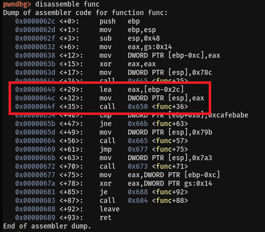
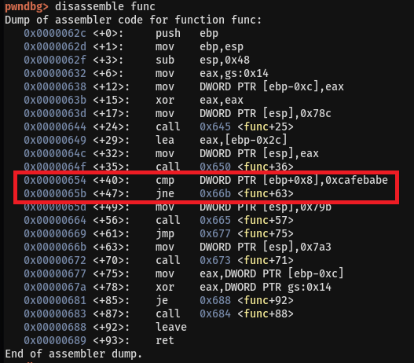

# 03. bof

## Source Code
```
#include <stdio.h>
#include <string.h>
#include <stdlib.h>
void func(int key){
	char overflowme[32];
	printf("overflow me : ");
	gets(overflowme);	// smash me!
	if(key == 0xcafebabe){
		system("/bin/sh");
	}
	else{
		printf("Nah..\n");
	}
}
int main(int argc, char* argv[]){
	func(0xdeadbeef);
	return 0;
}
```   

* func 함수에서 변수 overflow로 값을 입력받는다.   
```gets(overflowme);```   
<br/>

* 변수 key의 값이 0xcafebabe이면 쉘을 얻을 수 있다.   
```
if(key == 0xcafebabe){
	system("/bin/sh");
}
```   
<br/>   

## Writeup
변수 overflow로 값을 입력받을 때 오버플로우를 일으킬 수 있다.   
이를 이용해서 변수 key의 값을 0xcafebabe로 덮어씌우면 쉘을 얻을 수 있다.   
<br/>
<br/>

gdb로 분석해보자    
func함수의 0x00000649 부분을 보면 변수 overflow는 ebp-0x2c에 위치하고 있다.   
   
<br/>

또한 func함수의 0x00000654부분을 보면 변수 key는 ebp+0x8에 위치하고 있다.   
   
<br/>

따라서 두 변수는 52바이트 만큼 떨어져있으므로 변수 overflow를 더미로 채우고 뒤에 0xcafebabe를 넣으면 변수 key를 덮어 씌울 수 있다.   
