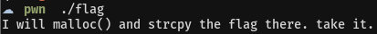
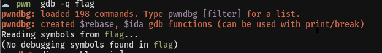
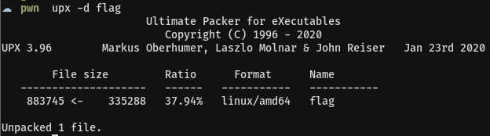
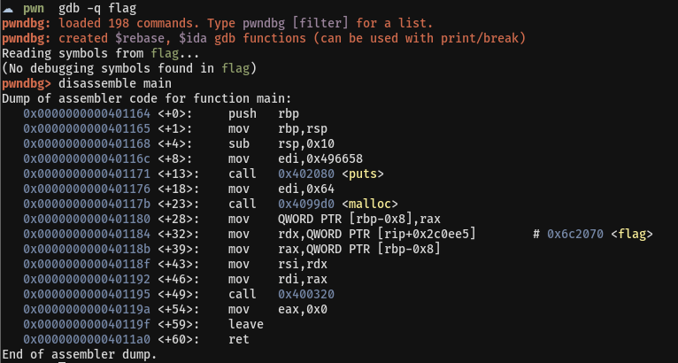
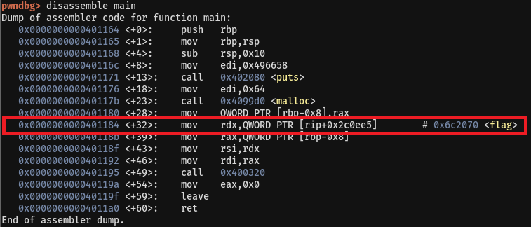
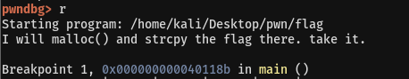
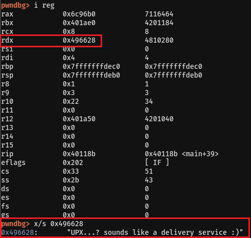

# 04. flag

## Writeup
문제에서 주어진 파일을 실행해보니 다음과 같이 나온다.   
   
 

파일을 gdb로 분석해보면 symbol을 찾을 수 없어 분석을 할 수 없다.   
 

Detect It Easy로 분석해보니 UPX 패킹이 확인되었다.   
   
 

UPX 때문에 분석을 제대로 할 수 없으니 UPX 패킹을 해제하고 분석해야 한다.   
다음과 같은 명령어로 해제할 수 있다.   
   
 

UPX 패킹이 해제되면 제대로 분석할 수 있다.   
gdb로 분석하면 다음과 같다.   
   
 

0x401184 부분을 보면 rdx로 flag 값이 저장되는 것을 추측할 수 있다.   
따라서 main+39부분에 break를 걸고 rdx 값을 확인해보자   
   
   
   
 

레지스트리 rdx의 값을 확인해보면 flag를 얻을 수 있다.
