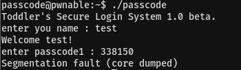
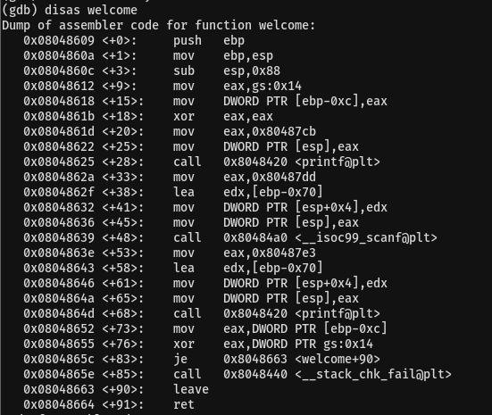
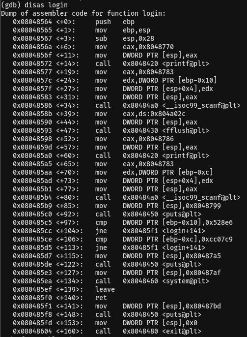
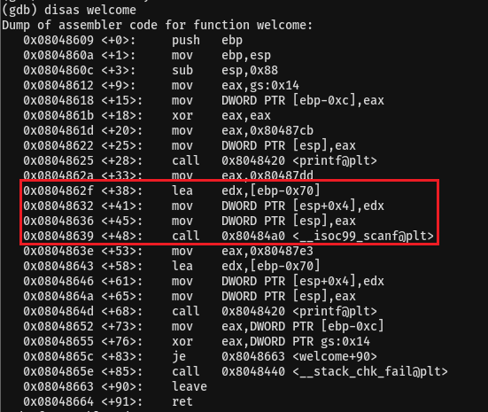
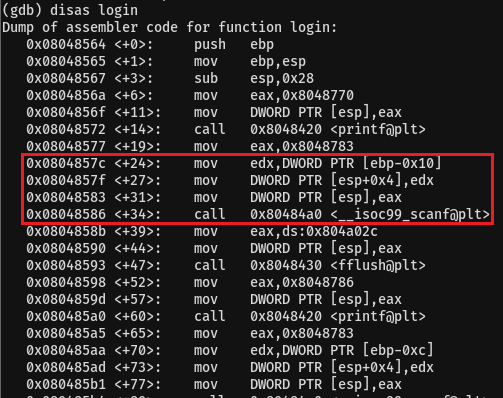
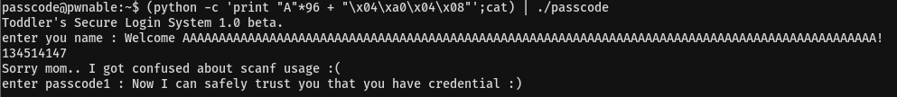

# 03. bof

## Source Code
```
#include <stdio.h>
#include <stdlib.h>

void login(){
	int passcode1;
	int passcode2;

	printf("enter passcode1 : ");
	scanf("%d", passcode1);
	fflush(stdin);

	// ha! mommy told me that 32bit is vulnerable to bruteforcing :)
	printf("enter passcode2 : ");
        scanf("%d", passcode2);

	printf("checking...\n");
	if(passcode1==338150 && passcode2==13371337){
                printf("Login OK!\n");
                system("/bin/cat flag");
        }
        else{
                printf("Login Failed!\n");
		exit(0);
        }
}

void welcome(){
	char name[100];
	printf("enter you name : ");
	scanf("%100s", name);
	printf("Welcome %s!\n", name);
}

int main(){
	printf("Toddler's Secure Login System 1.0 beta.\n");

	welcome();
	login();

	// something after login...
	printf("Now I can safely trust you that you have credential :)\n");
	return 0;	
}
```   

* welcome 함수에서 name으로 100바이트를 입력받는다.   
```
scanf("%100s", name);
```    
</br>

* login함수에서 passcode1과 passcode2를 입력받는다.   
```
scanf("%d", passcode1);
```   
```
scanf("%d", passcode2);
```   
<br/>

passcode1이 338150이고 passcode2가 13371337이면 flag를 읽을 수 있다.   
```
if(passcode1==338150 && passcode2==13371337){
	printf("Login OK!\n");
	system("/bin/cat flag");
}
```   
<br/>

## Writeup

간단히 생각해서 passcode1에 338150을 입력하니 segmentation fault가 뜬다.   
   
<br/>

자세히 보니 scanf에 &이 빠져있다.   
```
scanf("%d", passcode1);
```   
<br/>

이는 passcode1이란 변수에 값을 저장하는 것이 아니라 passcode1이라는 변수 안에 있는 값의 주소에 입력받은 값을 넣는 것이다.   
그래서 segmentation fault가 발생하는 것이다.   
</br>

그래서 다른 방법을 찾기 위해 gdb로 분석해보았다.   
   
   
</br>

welcome 함수를 보면 name 배열이 ebp-0x70에서 시작하고 있다.   
   
<br/>

login 함수를 보면 변수 passcode1는 ebp-0x10에 있다.   
   
<br/>

name과 passcode1의 차이는 0x60이다.   
하지만 name은 scanf로 100바이트만큼 입력받으니 4바이트의 오버플로우가 발생할 수 있다.
<br/>

따라서 다음과 같이 flag를 읽을 수 있다.   
```
1. name을 입력받을 때 96바이트의 더미값과 마지막 4바이트를 fflush 함수의 got값으로 한다.   
2. scanf("%d", passcode1);에서 system("/bin/sh flag");의 주소를 넣어준다.
3. fflush가 실행되면 flag를 읽을 수 있다.
```   
<br/>

* system("/bin/sh flag");의 주소는 10진수로 넣는다.   
</br>

