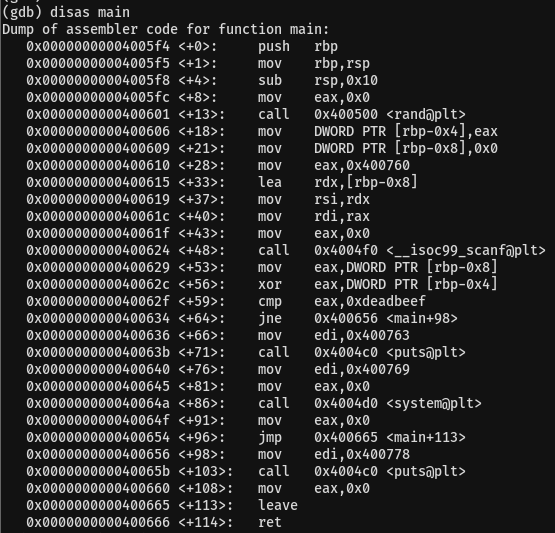
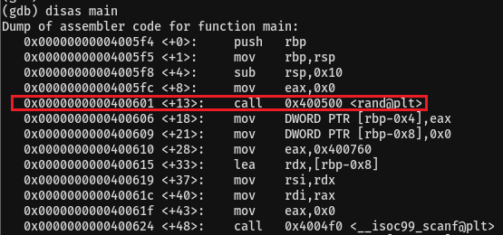
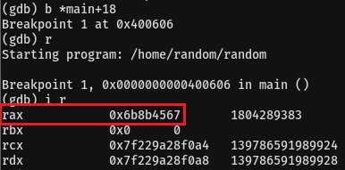
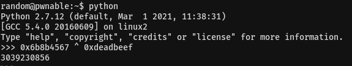
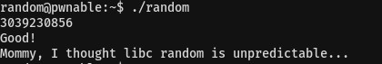

# 06. random

## Source Code
```
#include <stdio.h>

int main(){
	unsigned int random;
	random = rand();	// random value!

	unsigned int key=0;
	scanf("%d", &key);

	if( (key ^ random) == 0xdeadbeef ){
		printf("Good!\n");
		system("/bin/cat flag");
		return 0;
	}

	printf("Wrong, maybe you should try 2^32 cases.\n");
	return 0;
}
```   

* 랜덤 값을 변수 random에 넣는다.   
```
random = rand();
```   
<br/>

* 입력한 key값과 변수 random을 xor 연산 한 값이 0xdeadbeef이면 flag를 획득한다.   
```
if( (key ^ random) == 0xdeadbeef ){
	printf("Good!\n");
	system("/bin/cat flag");
	return 0;
} 
```   
<br/>

## Writeup

random으로 값을 생성하고 있지만 rand()함수는 매번 바뀌는 시드값을 주지 않으면 항상 같은 값을 반환한다.   
따라서 random변수에 들어가는 값을 한 번 알아내면 답을 구할 수 있다.   
<br/>

gdb로 분석해보자   
   
<br/>

rand()함수가 실행된 다음 부분에 break를 걸어 random 값을 확인하자   
random 값은 0x6b8b4567이다.   
   
   
<br/>

0x6b8b4567와 0xdeadbeef를 xor 연산 해주면 우리가 입력해야 하는 값을 알 수 있다.   
   
<br/>

   
